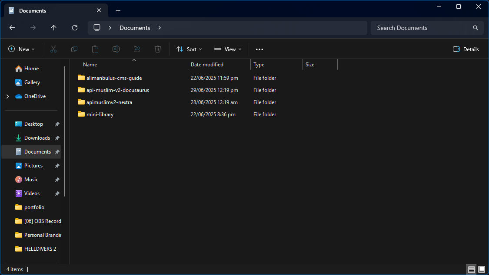
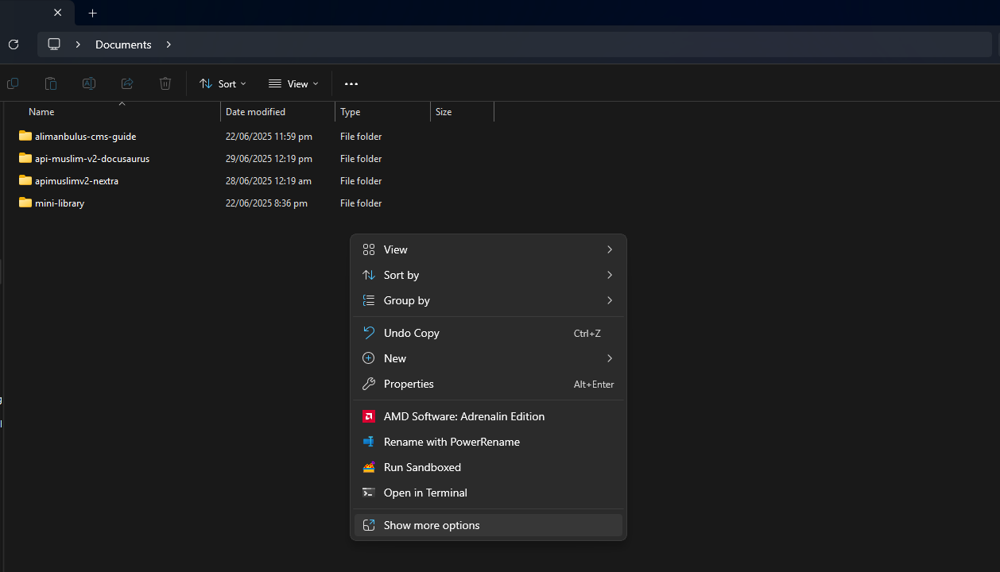
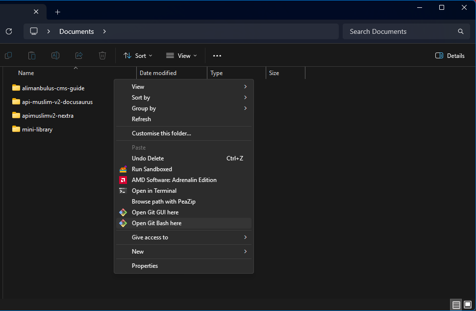
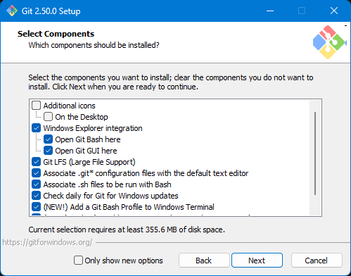

import Tabs from "@theme/Tabs";
import TabItem from "@theme/TabItem";

# Using Next.js

In this example, we are going to use Next.js App Router to create a simple application that fetches data from the API Muslim v2. For styling purpose, Next.js comes with Tailwind CSS pre-configured, so we can quickly style our application without any additional setup.

## Initialize Next.js project 

To initialize Next.js project, we will use my Windows machine (Windows 11) to create a new Next.js project using the Next.js CLI (`create-next-app`) and Git Bash. You need to install Node.js first before proceeding with the following steps. You can download it from the official website [Node.js](https://nodejs.org/). We highly recommend using the LTS (Long Term Support) version for better stability.

For the complete variation of commands using different package managers, refer to the official Next.js documentation: [Next.js Documentation](https://nextjs.org/docs/getting-started/installation).

1. Open folder where you want to create the project.
	I will place the project in `Documents` folder from Drive (C:)
	
	
2. Open terminal in that folder.
	You can do this by right-clicking on any empty space in the window and select `Show more options` 
	
	

	and then select `Open in Terminal` or `Open Git Bash`
	
	

	:::note

	To get `Open Git Bash here` option shows up, first you need to install Git. Download and install it from the official website: [Git](https://git-scm.com/)

	Then, during the installation, make sure to leave the option `Git Bash Here` checked. This will add the context menu option to open Git Bash in any folder.
	
	

	:::
3. Run the following command to create a new Next.js project:
	:::info Project Name

	`my-nextjs-app` is the argument for the project name. You can change it to whatever you like.
	
	:::

	```bash title="Git Bash"
	npx create-next-app@latest my-nextjs-app
	```

## Homepage of Next.js project

After waiting for the next.js project to be installed, we can now open the project in our favorite code editor. I will use Visual Studio Code for this example. 

If you go to the `app` folder, you will see a file named `page.tsx` or `page.jsx`. This is where we will write the function to fetch data from the API Muslim v2.

<Tabs groupId="programming-language-choice">
	<TabItem value="homepage-tsx" label="Typescript">
		```ts title="app/page.tsx"
		import Image from "next/image";

		export default function Home() {
		return (
			<div className="grid grid-rows-[20px_1fr_20px] items-center justify-items-center min-h-screen p-8 pb-20 gap-16 sm:p-20 font-[family-name:var(--font-geist-sans)]">
			<main className="flex flex-col gap-[32px] row-start-2 items-center sm:items-start">
				<Image
				className="dark:invert"
				src="/next.svg"
				alt="Next.js logo"
				width={180}
				height={38}
				priority
				/>
				<ol className="list-inside list-decimal text-sm/6 text-center sm:text-left font-[family-name:var(--font-geist-mono)]">
				<li className="mb-2 tracking-[-.01em]">
					Get started by editing{" "}
					<code className="bg-black/[.05] dark:bg-white/[.06] px-1 py-0.5 rounded font-[family-name:var(--font-geist-mono)] font-semibold">
					app/page.tsx
					</code>
					.
				</li>
				<li className="tracking-[-.01em]">
					Save and see your changes instantly.
				</li>
				</ol>

				<div className="flex gap-4 items-center flex-col sm:flex-row">
				<a
					className="rounded-full border border-solid border-transparent transition-colors flex items-center justify-center bg-foreground text-background gap-2 hover:bg-[#383838] dark:hover:bg-[#ccc] font-medium text-sm sm:text-base h-10 sm:h-12 px-4 sm:px-5 sm:w-auto"
					href="https://vercel.com/new?utm_source=create-next-app&utm_medium=appdir-template-tw&utm_campaign=create-next-app"
					target="_blank"
					rel="noopener noreferrer"
				>
					<Image
					className="dark:invert"
					src="/vercel.svg"
					alt="Vercel logomark"
					width={20}
					height={20}
					/>
					Deploy now
				</a>
				<a
					className="rounded-full border border-solid border-black/[.08] dark:border-white/[.145] transition-colors flex items-center justify-center hover:bg-[#f2f2f2] dark:hover:bg-[#1a1a1a] hover:border-transparent font-medium text-sm sm:text-base h-10 sm:h-12 px-4 sm:px-5 w-full sm:w-auto md:w-[158px]"
					href="https://nextjs.org/docs?utm_source=create-next-app&utm_medium=appdir-template-tw&utm_campaign=create-next-app"
					target="_blank"
					rel="noopener noreferrer"
				>
					Read our docs
				</a>
				</div>
			</main>
			<footer className="row-start-3 flex gap-[24px] flex-wrap items-center justify-center">
				<a
				className="flex items-center gap-2 hover:underline hover:underline-offset-4"
				href="https://nextjs.org/learn?utm_source=create-next-app&utm_medium=appdir-template-tw&utm_campaign=create-next-app"
				target="_blank"
				rel="noopener noreferrer"
				>
				<Image
					aria-hidden
					src="/file.svg"
					alt="File icon"
					width={16}
					height={16}
				/>
				Learn
				</a>
				<a
				className="flex items-center gap-2 hover:underline hover:underline-offset-4"
				href="https://vercel.com/templates?framework=next.js&utm_source=create-next-app&utm_medium=appdir-template-tw&utm_campaign=create-next-app"
				target="_blank"
				rel="noopener noreferrer"
				>
				<Image
					aria-hidden
					src="/window.svg"
					alt="Window icon"
					width={16}
					height={16}
				/>
				Examples
				</a>
				<a
				className="flex items-center gap-2 hover:underline hover:underline-offset-4"
				href="https://nextjs.org?utm_source=create-next-app&utm_medium=appdir-template-tw&utm_campaign=create-next-app"
				target="_blank"
				rel="noopener noreferrer"
				>
				<Image
					aria-hidden
					src="/globe.svg"
					alt="Globe icon"
					width={16}
					height={16}
				/>
				Go to nextjs.org →
				</a>
			</footer>
			</div>
		);
		}

		```
	</TabItem>
	<TabItem value="homepage-js" label="Javascript">
		```js title="app/page.js"
		import Image from "next/image";

		export default function Home() {
		return (
			<div className="grid grid-rows-[20px_1fr_20px] items-center justify-items-center min-h-screen p-8 pb-20 gap-16 sm:p-20 font-[family-name:var(--font-geist-sans)]">
			<main className="flex flex-col gap-[32px] row-start-2 items-center sm:items-start">
				<Image
				className="dark:invert"
				src="/next.svg"
				alt="Next.js logo"
				width={180}
				height={38}
				priority
				/>
				<ol className="list-inside list-decimal text-sm/6 text-center sm:text-left font-[family-name:var(--font-geist-mono)]">
				<li className="mb-2 tracking-[-.01em]">
					Get started by editing{" "}
					<code className="bg-black/[.05] dark:bg-white/[.06] px-1 py-0.5 rounded font-[family-name:var(--font-geist-mono)] font-semibold">
					app/page.tsx
					</code>
					.
				</li>
				<li className="tracking-[-.01em]">
					Save and see your changes instantly.
				</li>
				</ol>

				<div className="flex gap-4 items-center flex-col sm:flex-row">
				<a
					className="rounded-full border border-solid border-transparent transition-colors flex items-center justify-center bg-foreground text-background gap-2 hover:bg-[#383838] dark:hover:bg-[#ccc] font-medium text-sm sm:text-base h-10 sm:h-12 px-4 sm:px-5 sm:w-auto"
					href="https://vercel.com/new?utm_source=create-next-app&utm_medium=appdir-template-tw&utm_campaign=create-next-app"
					target="_blank"
					rel="noopener noreferrer"
				>
					<Image
					className="dark:invert"
					src="/vercel.svg"
					alt="Vercel logomark"
					width={20}
					height={20}
					/>
					Deploy now
				</a>
				<a
					className="rounded-full border border-solid border-black/[.08] dark:border-white/[.145] transition-colors flex items-center justify-center hover:bg-[#f2f2f2] dark:hover:bg-[#1a1a1a] hover:border-transparent font-medium text-sm sm:text-base h-10 sm:h-12 px-4 sm:px-5 w-full sm:w-auto md:w-[158px]"
					href="https://nextjs.org/docs?utm_source=create-next-app&utm_medium=appdir-template-tw&utm_campaign=create-next-app"
					target="_blank"
					rel="noopener noreferrer"
				>
					Read our docs
				</a>
				</div>
			</main>
			<footer className="row-start-3 flex gap-[24px] flex-wrap items-center justify-center">
				<a
				className="flex items-center gap-2 hover:underline hover:underline-offset-4"
				href="https://nextjs.org/learn?utm_source=create-next-app&utm_medium=appdir-template-tw&utm_campaign=create-next-app"
				target="_blank"
				rel="noopener noreferrer"
				>
				<Image
					aria-hidden
					src="/file.svg"
					alt="File icon"
					width={16}
					height={16}
				/>
				Learn
				</a>
				<a
				className="flex items-center gap-2 hover:underline hover:underline-offset-4"
				href="https://vercel.com/templates?framework=next.js&utm_source=create-next-app&utm_medium=appdir-template-tw&utm_campaign=create-next-app"
				target="_blank"
				rel="noopener noreferrer"
				>
				<Image
					aria-hidden
					src="/window.svg"
					alt="Window icon"
					width={16}
					height={16}
				/>
				Examples
				</a>
				<a
				className="flex items-center gap-2 hover:underline hover:underline-offset-4"
				href="https://nextjs.org?utm_source=create-next-app&utm_medium=appdir-template-tw&utm_campaign=create-next-app"
				target="_blank"
				rel="noopener noreferrer"
				>
				<Image
					aria-hidden
					src="/globe.svg"
					alt="Globe icon"
					width={16}
					height={16}
				/>
				Go to nextjs.org →
				</a>
			</footer>
			</div>
		);
		}
		```
	</TabItem>
</Tabs>

## Create a function to fetch data from API Muslim v2

<Tabs groupId="programming-language-choice">
	<TabItem value="function-and-type-declaration" label="Typescript">
	To ensure the type safety of our function, we will use TypeScript to define the types of the data we are fetching from the API Muslim v2. 

	```ts title="PrayerTimesResponse"
	export type PrayerTimesResponse={
		status: boolean;
		request: {
			path: string;
		};
		data: {
			id: number;
			lokasi: string;
			daerah: string;
			jadwal: {
				tanggal: string;
				imsak: string;
				subuh: string;
				terbit: string;
				dhuha: string;
				dzuhur: string;
				ashar: string;
				maghrib: string;
				isya: string;
				date: string;
			};
		};
	}
	```

	Then, we will create a function to fetch the prayer times data from the API Muslim v2. We will use the `fetch` API to make the request and return the data in the form of `PrayerTimesResponse` type.

	```ts title="function getTodayPrayerTimes"
	export async function getTodayPrayerTimes(): Promise<PrayerTimesResponse> {
		// using Kota Semarang as the default location
		const cityId = 1433;
		const date = new Date();
		const year = date.getFullYear();
		const month = String(date.getMonth() + 1).padStart(2, "0");
		const day = String(date.getDate()).padStart(2, "0");

		const todayPrayerTimesResponse = await fetch(
			`https://api.myquran.com/v2/sholat/jadwal/${cityId}/${year}/${month}/${day}`
		);
		return todayPrayerTimesResponse.json();
	}
	```
	</TabItem>
	<TabItem value="function-declaration-js" label="Javascript">
	Since JavaScript does not have a built-in type system like TypeScript, we will not define the types for the data we are fetching. However, we can still create a function to fetch the prayer times data from the API Muslim v2.

	```js title="function getTodayPrayerTimes"
	export async function getTodayPrayerTimes() {
		// using Kota Semarang as the default location
		const cityId = 1433;
		const date = new Date();
		const year = date.getFullYear();
		const month = String(date.getMonth() + 1).padStart(2, "0");
		const day = String(date.getDate()).padStart(2, "0");

		const todayPrayerTimesResponse = await fetch(
			`https://api.myquran.com/v2/sholat/jadwal/${cityId}/${year}/${month}/${day}`
		);
		return todayPrayerTimesResponse.json();
	}
	```
	</TabItem>
</Tabs>

## Add `async` to `Home` function

To use the `getTodayPrayerTimes` function in our `Home` component, we need to make the `Home` function asynchronous. This is because we will be fetching data from the API Muslim v2, which is an asynchronous operation.

<Tabs groupId="programming-language-choice">
	<TabItem value="add-async" label="Typescript">
		Before changing:

		```ts title="app/page.tsx"
		export default function Home() {
			return (
				/* The rest of the code */
			)
		}
		```

		After changing:
		
		```ts title="app/page.tsx"
		export default async function Home() {
			return (
				/* The rest of the code */
			)
		}
		```
	</TabItem>
	<TabItem value="add-async-js" label="Javascript">
		Before changing:

		```ts title="app/page.js"
		export default function Home() {
			return (
				/* The rest of the code */
			)
		}
		```

		After changing:
		
		```ts title="app/page.js"
		export default async function Home() {
			return (
				/* The rest of the code */
			)
		}
		```
	</TabItem>
</Tabs>

## Fetch data inside `Home` function

We also add `console.log()` to see the result of the `getTodayPrayerTimes` function in the console.

<Tabs groupId="programming-language-choice">
	<TabItem value="fetch-data-in-home-ts" label="Typescript">
		```tsx title="app/page.tsx"
		export default async function Home() {
			const todayPrayerTimesData = await getTodayPrayerTimes();
			console.log("Today's prayer times data:", todayPrayerTimesData);
			return (
				/* The rest of the code */
			)
		}
		```
	</TabItem>
	<TabItem value="fetch-data-in-home-js" label="Javascript">
		```ts title="app/page.js"
		export default async function Home() {
			const todayPrayerTimesData = await getTodayPrayerTimes();
			console.log("Today's prayer times data:", todayPrayerTimesData);
			return (
				/* The rest of the code */
			)
		}
		```
	</TabItem>
</Tabs>

## Render the data in the component

To render the data, we will use the `todayPrayerTimesData` variable that we have fetched from the API Muslim v2. We will display the prayer times in a card format

<Tabs groupId="programming-language-choice">
	<TabItem value="render-data-tsx" label="Typescript">
		```tsx title="app/page.tsx"
		export default async function Home() {
			const todayPrayerTimesData = await getTodayPrayerTimes();
			console.log("Today's prayer times data:", todayPrayerTimesData);
			return (
				<div className="grid grid-rows-[20px_1fr_20px] items-center justify-items-center min-h-screen p-8 pb-20 gap-16 sm:p-20 font-[family-name:var(--font-geist-sans)]">
					<main className="flex flex-col gap-[32px] row-start-2 items-center sm:items-start">
						<h1 className="font-bold">
							API Muslim v2 with Next.js 15 App Router and Typescript
						</h1>
						<div className="flex flex-col">
							City: {todayPrayerTimesData.data.lokasi}{" "}
							<span>Today date: {todayPrayerTimesData.data.jadwal.tanggal}</span>
						</div>
						<div className="italic">All prayer times are based on UTC+7 </div>
						<div className="flex flex-col md:flex-row flex-wrap gap-4">
							<div className="flex flex-col rounded-md border-2 p-2">
								<span>Fajr (Subuh):</span>
								<span className="text-lg font-bold">
									{todayPrayerTimesData.data.jadwal.subuh} WIB
								</span>
							</div>
							<div className="flex flex-col rounded-md border-2 p-2">
								<span>Sunrise (Terbit):</span>
								<span className="text-lg font-bold">
									{todayPrayerTimesData.data.jadwal.terbit} WIB
								</span>
							</div>
							<div className="flex flex-col rounded-md border-2 p-2">
								<span>Duha (Dhuha):</span>
								<span className="text-lg font-bold">
									{todayPrayerTimesData.data.jadwal.dhuha} WIB
								</span>
							</div>
							<div className="flex flex-col rounded-md border-2 p-2">
								<span>Dhuhr (Dzuhur):</span>
								<span className="text-lg font-bold">
									{todayPrayerTimesData.data.jadwal.dzuhur} WIB
								</span>
							</div>
							<div className="flex flex-col rounded-md border-2 p-2">
								<span>Asr (Ashar):</span>
								<span className="text-lg font-bold">
									{todayPrayerTimesData.data.jadwal.ashar} WIB
								</span>
							</div>
							<div className="flex flex-col rounded-md border-2 p-2">
								<span>Maghrib:</span>
								<span className="text-lg font-bold">
									{todayPrayerTimesData.data.jadwal.maghrib} WIB
								</span>
							</div>
							<div className="flex flex-col rounded-md border-2 p-2">
								<span>{`Isha'`} (Isya/Isyak):</span>
								<span className="text-lg font-bold">
									{todayPrayerTimesData.data.jadwal.isya} WIB
								</span>
							</div>
							<footer className="row-start-3 flex gap-[24px] flex-wrap items-center justify-center">
								<a
									className="flex items-center gap-2 hover:underline hover:underline-offset-4"
									href="https://nextjs.org/learn?utm_source=create-next-app&utm_medium=appdir-template-tw&utm_campaign=create-next-app"
									target="_blank"
									rel="noopener noreferrer"
								>
									<Image
										aria-hidden
										src="/file.svg"
										alt="File icon"
										width={16}
										height={16}
									/>
									Learn
								</a>
								<a
									className="flex items-center gap-2 hover:underline hover:underline-offset-4"
									href="https://vercel.com/templates?framework=next.js&utm_source=create-next-app&utm_medium=appdir-template-tw&utm_campaign=create-next-app"
									target="_blank"
									rel="noopener noreferrer"
								>
									<Image
										aria-hidden
										src="/window.svg"
										alt="Window icon"
										width={16}
										height={16}
									/>
									Examples
								</a>
								<a
									className="flex items-center gap-2 hover:underline hover:underline-offset-4"
									href="https://nextjs.org?utm_source=create-next-app&utm_medium=appdir-template-tw&utm_campaign=create-next-app"
									target="_blank"
									rel="noopener noreferrer"
								>
									<Image
										aria-hidden
										src="/globe.svg"
										alt="Globe icon"
										width={16}
										height={16}
									/>
									Go to nextjs.org →
								</a>
							</footer>
						</div>
					</main>
				</div>
			)
		}
		```
	</TabItem>
	<TabItem value="render-data-js" label="Javascript">
		```js title="app/page.js"
		export default async function Home() {
			const todayPrayerTimesData = await getTodayPrayerTimes();
			console.log("Today's prayer times data:", todayPrayerTimesData);
			return (
				<div className="grid grid-rows-[20px_1fr_20px] items-center justify-items-center min-h-screen p-8 pb-20 gap-16 sm:p-20 font-[family-name:var(--font-geist-sans)]">
					<main className="flex flex-col gap-[32px] row-start-2 items-center sm:items-start">
						<h1 className="font-bold">
							API Muslim v2 with Next.js 15 App Router and Typescript
						</h1>
						<div className="flex flex-col">
							City: {todayPrayerTimesData.data.lokasi}{" "}
							<span>Today date: {todayPrayerTimesData.data.jadwal.tanggal}</span>
						</div>
						<div className="italic">All prayer times are based on UTC+7 </div>
						<div className="flex flex-col md:flex-row flex-wrap gap-4">
							<div className="flex flex-col rounded-md border-2 p-2">
								<span>Fajr (Subuh):</span>
								<span className="text-lg font-bold">
									{todayPrayerTimesData.data.jadwal.subuh} WIB
								</span>
							</div>
							<div className="flex flex-col rounded-md border-2 p-2">
								<span>Sunrise (Terbit):</span>
								<span className="text-lg font-bold">
									{todayPrayerTimesData.data.jadwal.terbit} WIB
								</span>
							</div>
							<div className="flex flex-col rounded-md border-2 p-2">
								<span>Duha (Dhuha):</span>
								<span className="text-lg font-bold">
									{todayPrayerTimesData.data.jadwal.dhuha} WIB
								</span>
							</div>
							<div className="flex flex-col rounded-md border-2 p-2">
								<span>Dhuhr (Dzuhur):</span>
								<span className="text-lg font-bold">
									{todayPrayerTimesData.data.jadwal.dzuhur} WIB
								</span>
							</div>
							<div className="flex flex-col rounded-md border-2 p-2">
								<span>Asr (Ashar):</span>
								<span className="text-lg font-bold">
									{todayPrayerTimesData.data.jadwal.ashar} WIB
								</span>
							</div>
							<div className="flex flex-col rounded-md border-2 p-2">
								<span>Maghrib:</span>
								<span className="text-lg font-bold">
									{todayPrayerTimesData.data.jadwal.maghrib} WIB
								</span>
							</div>
							<div className="flex flex-col rounded-md border-2 p-2">
								<span>{`Isha'`} (Isya/Isyak):</span>
								<span className="text-lg font-bold">
									{todayPrayerTimesData.data.jadwal.isya} WIB
								</span>
							</div>
							<footer className="row-start-3 flex gap-[24px] flex-wrap items-center justify-center">
								<a
									className="flex items-center gap-2 hover:underline hover:underline-offset-4"
									href="https://nextjs.org/learn?utm_source=create-next-app&utm_medium=appdir-template-tw&utm_campaign=create-next-app"
									target="_blank"
									rel="noopener noreferrer"
								>
									<Image
										aria-hidden
										src="/file.svg"
										alt="File icon"
										width={16}
										height={16}
									/>
									Learn
								</a>
								<a
									className="flex items-center gap-2 hover:underline hover:underline-offset-4"
									href="https://vercel.com/templates?framework=next.js&utm_source=create-next-app&utm_medium=appdir-template-tw&utm_campaign=create-next-app"
									target="_blank"
									rel="noopener noreferrer"
								>
									<Image
										aria-hidden
										src="/window.svg"
										alt="Window icon"
										width={16}
										height={16}
									/>
									Examples
								</a>
								<a
									className="flex items-center gap-2 hover:underline hover:underline-offset-4"
									href="https://nextjs.org?utm_source=create-next-app&utm_medium=appdir-template-tw&utm_campaign=create-next-app"
									target="_blank"
									rel="noopener noreferrer"
								>
									<Image
										aria-hidden
										src="/globe.svg"
										alt="Globe icon"
										width={16}
										height={16}
									/>
									Go to nextjs.org →
								</a>
							</footer>
						</div>
					</main>
				</div>
			)
		}
		```
	</TabItem>
</Tabs>

:::info 
These parts are generated code from the template used by `create-next-app`

```jsx title="Wrapper HTML tags for app/page.tsx and app/page.js"
<div className="grid grid-rows-[20px_1fr_20px] items-center justify-items-center min-h-screen p-8 pb-20 gap-16 sm:p-20 font-[family-name:var(--font-geist-sans)]">
	<main className="flex flex-col gap-[32px] row-start-2 items-center sm:items-start">
			/* Our code here for rendering prayer times */
	</main>
	<footer className="row-start-3 flex gap-[24px] flex-wrap items-center justify-center">
		<a
			className="flex items-center gap-2 hover:underline hover:underline-offset-4"
			href="https://nextjs.org/learn?utm_source=create-next-app&utm_medium=appdir-template-tw&utm_campaign=create-next-app"
			target="_blank"
			rel="noopener noreferrer"
			>
				<Image
					aria-hidden
					src="/file.svg"
					alt="File icon"
					width={16}
					height={16}
				/>
					Learn
			</a>
		<a
			className="flex items-center gap-2 hover:underline hover:underline-offset-4"
			href="https://vercel.com/templates?framework=next.js&utm_source=create-next-app&utm_medium=appdir-template-tw&utm_campaign=create-next-app"
			target="_blank"
			rel="noopener noreferrer"
			>
				<Image
					aria-hidden
					src="/window.svg"
					alt="Window icon"
					width={16}
					height={16}
				/>
					Examples
		</a>
		<a
			className="flex items-center gap-2 hover:underline hover:underline-offset-4"
			href="https://nextjs.org?utm_source=create-next-app&utm_medium=appdir-template-tw&utm_campaign=create-next-app"
			target="_blank"
			rel="noopener noreferrer"
			>
				<Image
					aria-hidden
					src="/globe.svg"
					alt="Globe icon"
					width={16}
					height={16}
				/>
					Go to nextjs.org →
		</a>
		</footer>
</div>

```
:::